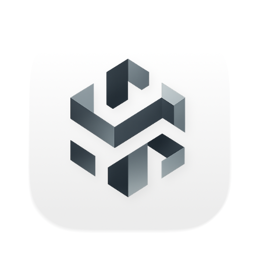

Nowledge Labs · PyConf 2026

# Skein

## 为 AI 时代打造的嵌入式知识数据库

一个 AI Agent 记忆系统的存储引擎重构故事： 
把图数据库、向量索引、关系型存储合并成一个嵌入式引擎，会发生什么。

  

    
    
    
  

  

    Weizhen Wang
    @hawkingrei · Nowledge Labs · Nowledge Mem
  

  
<ph-graph class="merge-node__icon" />
Kuzu / Ladybug

图存储

  
<ph-magnifying-glass class="merge-node__icon" />
LanceDB

向量 · 全文

  
<ph-table class="merge-node__icon" />
SQLite

关系型内容

<svg class="merge-lines" viewBox="0 0 300 68" width="100%" height="68" preserveAspectRatio="none" aria-hidden="true">
  <path d="M50,0 C50,38 100,52 150,64" fill="none" stroke="var(--sky)" stroke-width="2.6" stroke-linecap="round" opacity="0.8" />
  <path d="M150,0 L150,64" fill="none" stroke="var(--teal)" stroke-width="2.6" stroke-linecap="round" opacity="0.8" />
  <path d="M250,0 C250,38 200,52 150,64" fill="none" stroke="var(--rose)" stroke-width="2.6" stroke-linecap="round" opacity="0.8" />
</svg>

<ph-git-merge class="merge-node__icon" />
Skein

一个嵌入式引擎，三份数据合一

<!--
一条记忆既有原始内容，也有实体关系，还要支持语义检索。今天讲我们为什么把这些工作收进同一个存储引擎，以及实现和交付时做了哪些取舍。
-->

---

# 分享路线

  
01选型

  

    
为什么重做存储引擎

    
从三个数据库的协调成本说起

  

  
02设计

  

    
Skein 如何工作

    
统一查询、优化执行、并发与 AI 接入

  

  
03验证

  

    
怎样验证并交付

    
模型检查、结果对照与性能实测

  

  
04灰度

  

    
走进 Nowledge Mem

    
灰度进展、迁移路径与未来方向

  

<!--
先说明选型问题，再看引擎怎样组织查询与数据。第三部分讲验证和交付，第四部分讲灰度进展和后续方向。
-->

---
layout: center
class: deck-part-hero
---

01 选型·02 设计·03 验证·04 灰度

第 1 部分

# 为什么要重新造一个存储引擎

一个 AI Agent 的记忆，长在三个数据库里

<!--
先看我们原来的存储组合，以及为什么应用层承担了越来越多的协调工作。
-->

---

01 选型·02·03·04

# 一份记忆，三份存储

Nowledge Mem 的每一条记忆，同时要满足三种访问模式： 
它跟别的记忆的<strong class="c1">关系</strong>，它的<strong class="c1">语义相似度</strong>，还有它的<strong class="c1">原始内容</strong>。

  
三种访问模式，分别交给专门的存储

  

    <strong class="c1">Kuzu / Ladybug</strong>（图）· <strong class="c1">LanceDB</strong>（向量 + 全文）· <strong class="c1">SQLite</strong>（关系型内容） 
    这是 Mem 当时采用的分工：图存储维护关系，搜索索引负责召回，内容存储保留原文。
  

  同一条记忆的身份、更新和删除，需要由应用层协调。

  

Kuzu / Ladybug

图存储 · 关系

  
＋

  

LanceDB

向量 · 全文索引

  
＋

  

SQLite

关系型内容存储

  
= 谁来保证一致？

<!--
这页只交代旧架构：关系、检索和内容分别落在三个系统里。
下一步先回答选型问题：能否直接把它们都放进 SQLite？
-->

---

01 选型·02·03·04

# 为什么不直接用 SQLite？

SQLite 能承载内容和事务。我们的取舍在于：图遍历、检索和它们的生命周期，要由谁来组织。

  

    
SQLite 的能力来源

    

      
原生 进程内嵌入、关系数据和事务。

      
原生 SQL 递归 CTE 可表达遍历；节点表、边表由应用建模。

      
官方扩展 FTS5 全文检索，需编译启用或单独加载。

      
第三方扩展 向量检索可接入 sqlite-vec，需额外集成。

    

  

  

    
Mem 仍需组织的工作

    

      
把实体、关系和路径作为直接的查询对象。

      
把向量召回与图、内容查询接起来。

      
协调数据变更、索引更新和恢复。

    

  

继续组合现有能力，还是把这套语义和生命周期收进引擎，是这次选型的核心。

<!--
SQLite 的事务与递归 CTE 属于原生能力；应用可用节点表、边表和递归查询表达图遍历。
FTS5 是随 SQLite 源码提供的官方扩展，可编译启用，也可作为可加载扩展集成。发行包是否已启用取决于构建配置，不能一概写成开箱可用或必须另外安装。
向量检索可通过 sqlite-vec 等第三方扩展接入。对 Mem 而言，应用还要维护图查询、向量召回以及它们和原始内容之间的约定。
这是一项围绕具体负载的取舍，不是对 SQLite 的通用能力排名。
接下来用一次写入和一次读取，说明这些协调工作出现在哪里。

[Sources]
- https://www.sqlite.org/whentouse.html
- https://www.sqlite.org/lang_with.html
- https://www.sqlite.org/fts5.html
- https://www.sqlite.org/loadext.html
- https://github.com/asg017/sqlite-vec
- skein/docs/ARCHITECTURE.md
-->

---

01 选型·02·03·04

# 跨库协调的代价

当三个系统可以独立成功或失败，应用必须维护整条记忆的状态。

  

写入：部分成功怎么办

内容已经提交，图或搜索更新失败，需要补偿、重试和对账。

  

更新：索引何时追上事实

图事实和内容已经变化，检索投影仍可能处于异步更新或重建中。

  

读取：结果还要跨库取回

图或向量检索先返回 ID，再到内容存储取回原文，增加调用和序列化。

  

恢复：状态如何重新对齐

三个系统各有日志、备份和版本，恢复后还要检查彼此是否一致。

<!--
以保存一条记忆为例，局部提交成功并不代表整条操作完成。读路径也有类似的拼接工作。
搜索投影可以异步更新，但必须有明确的更新和恢复约定；图中的实体关系本身不能笼统地当作可丢弃索引。
这些协调成本促成了 Skein：把数据和查询的边界交给同一个引擎管理。
-->

---
layout: center
class: deck-part-hero
---

01 选型·02 设计·03 验证·04 灰度

第 2 部分

# Skein 是什么

嵌入式 · 统一引擎 · 面向 AI 的查询

---

01·02 设计·03·04

# 一个引擎，三类职责

Skein 是面向 Agent 记忆的嵌入式 Rust 数据库引擎，统一管理图、内容和检索。

  

语言前端

Cypher 与 PostgreSQL SQL / SQL-PGQ。

解析与绑定后，进入共享计划。

  

查询与存储内核

计划、优化器、执行器，以及图和关系数据。

统一 catalog、事务与 WAL。

  

检索与运行支持

全文、向量检索、图分析，以及资源治理。

按职责分模块，部分能力可按需组合。

部署在同一个进程里，内部仍保持清晰的模块边界。

<!--
这一页是后续几页的地图：先看它怎样嵌入应用，再看查询如何经过前端、优化器和执行器，最后看检索如何使用这些能力。
统一引擎不要求所有实现挤进一个模块。接口和依赖方向仍需要保持清楚。

[Sources]
- skein/docs/ARCHITECTURE.md（模块结构与共享内核）
- skein/docs/specs/EMBEDDED_RUNTIME_SPEC.md（可组合能力）
-->

---

01·02 设计·03·04

# 嵌入式优先，也可由宿主服务化

  

本地嵌入

宿主应用在进程内调用数据库，不需要独立的数据库服务。

适合离线使用和本地低延迟查询。

  

宿主服务化

需要共享访问时，由宿主把同一套数据库接口放在服务 API 后。

连接管理和业务调度由宿主负责。

这是同一个内核的两种接入方式；服务化由宿主实现。

<!--
本地嵌入解决进程内调用和离线使用。共享访问则可以由宿主包装服务接口，内核无需复制成另一套实现。
这里说明集成边界，不代表已经提供一个独立的 Skein server 产品。
下面进入查询路径：不同查询语言怎样使用同一套内核。

[Sources]
- skein/docs/ARCHITECTURE.md（宿主集成与运行边界）
-->

---

01·02 设计·03·04

# 一个引擎，两种查询语言

两种语言分别解析和绑定，随后汇入共享逻辑计划。

  

    
Cypher图查询

    
→

    
AST

    
→

    
语义图查询模型

  

  
↓

  

    
共享逻辑计划

    
→

    
Cascades优化器

    
→

    
物理计划

    
→

    
执行器

    
→

    
行

  

  
↑

  

    
PostgreSQL SQL+ SQL/PGQ

    
→

    
语法 AST

    
→

    
类型绑定

  

SQL/PGQ 通过 <code>CREATE PROPERTY GRAPH</code> 和 <code>GRAPH_TABLE</code>，在 SQL 中表达图查询。

<!--
两条前端路径分别完成解析和绑定，之后共享计划、优化和执行。
SQL/PGQ 在 SQL 中嵌入图查询，不需要先生成 Cypher 文本。这里不展开标准编号或方言版本，也不等同于独立 GQL 实现。
下一页只展开图中的优化器。

[Sources]
- skein/docs/specs/POSTGRES_SQL_PGQ_SPEC.md
-->

---

01·02 设计·03·04

# 优化器流程

优化器把共享逻辑计划变成物理计划，在保持查询语义的前提下，决定具体怎么执行。

  
逻辑计划要计算什么

  
→

  
规则改写简化计划

  
→

  
候选计划探索执行方式

  
→

  
代价比较比较估算开销

  
→

  
物理计划具体怎么执行

同一个查询可以有不同的连接顺序和数据访问方式；优化器按估算代价选择计划。

<!--
- 先用规则简化计划，保持查询语义不变。
- 再考虑不同的执行方式，例如先连接哪些表、怎样读取数据，并比较估算代价。
- 最后选出物理计划，告诉执行器具体怎么做。代价是估算值，不保证实际执行一定最快。

[Sources]
- skein/docs/ARCHITECTURE.md（共享查询流水线）
- skein/crates/optimizer/src/stage.rs（规则改写）
- skein/crates/optimizer/src/relational_join.rs（连接规划）
- skein/crates/optimizer/src/relational.rs（访问路径选择）
-->

---

01·02 设计·03·04

# 执行器原理

执行器按物理计划运行：每个算子接收数据、完成一项操作，再把结果传给下游。

以一个筛选行、选择输出列的查询为例

  
扫描读取数据

  
→

  
过滤保留符合条件的行

  
→

  
投影选择输出列

  
→

  
返回结果交给调用方

  
<strong class="c1">分批处理：</strong>流式算子每次处理一批大小受限的数据，再传给下一个算子。

  
<strong class="c1">阻塞操作：</strong>排序、聚合需要先积累状态，再输出结果，过程受内存预算约束。

<!--
- 优化器已经选好物理计划，执行器接下来逐项完成其中的操作。
- 这个例子中，扫描负责读取数据，过滤保留符合条件的行，投影选择要返回的列。
- 流式算子分批向下游传递数据。调用方拿到足够结果后，可以通过停止信号提前结束。
- 排序、聚合需要先积累中间状态才能输出，因此会打断流式处理，也需要管理内存。

[Sources]
- skein/src/executor/batch.rs（物理计划分派、过滤、投影）
- skein/crates/executor/src/pipeline.rs（批次输出与停止信号传递）
- skein/crates/executor/src/blocking.rs（阻塞算子执行上下文）
- skein/docs/ARCHITECTURE.md（执行内存限制）
-->

---

01·02 设计·03·04

# 并发模型

同一进程内，任务共享受控的执行资源，事务基于稳定快照读取数据。

  
任务调度与并行执行

  

    
宿主决定任务何时运行，运行时准入控制限制同时运行的工作量。

    
适合并行的执行路径把输入拆成独立的数据块，交给共享线程池处理。

    
CPU 和内存预算共同限制并行度。

  

  
读写并发

  

    
读者固定一个快照，后续提交不会改变它正在读取的数据视图。

    
并发事务在各自的私有工作区准备修改，通过冲突检查或锁协调写入。

    
持久化提交与状态发布串行完成，新读者看到发布后的状态。

  

<!--
- 并发分成两部分：执行任务怎样调度，以及对共享数据的访问怎样协调。
- 宿主调度任务，运行时控制同时运行的工作量。适合并行的执行路径会把输入分块，交给共享线程池；并不是所有算子都会并行。
- 读者保持固定快照。并发写者准备各自的私有修改，通过检查或锁协调冲突。
- 提交和发布串行完成。已有读者继续使用旧快照，新读者可以读取新发布的状态。
- 这是进程内的并发模型，同一数据库路径共享一个根句柄，不代表支持多个进程同时写入同一批文件，也不承诺通用的可串行化隔离级别。

[Sources]
- skein/crates/runtime-tokio/src/lib.rs（执行前的任务准入）
- skein/crates/executor/src/concurrent.rs（共享线程池）
- skein/crates/executor/src/morsel.rs（受限并行任务）
- skein/src/executor/columnar.rs（可并行执行的路径与准入）
- skein/src/api/concurrent.rs（读快照与并发事务）
- skein/docs/specs/EMBEDDED_RUNTIME_SPEC.md（并发与发布约定）
-->

---

01·02 设计·03·04

# 检索：关键词与语义相似

  

全文检索

用 BM25 匹配关键词，适合名称、术语和明确出现过的表达。

默认启用，也可按需裁剪。

  

向量检索

按向量相似度召回，寻找措辞不同但语义接近的内容。

与图和内容查询使用同一个引擎。

检索索引是可重建投影。索引损坏时，从权威数据恢复，不丢弃图事实和原始内容。

<!--
关键词和语义相似是互补的检索入口，这里不承诺某个自动混合排序策略。
重点是索引的生命周期：图事实和原始内容是恢复依据，全文和向量索引可以重建。
下一页看另一种访问方式：让 LLM 根据图结构生成受约束的查询。

[Sources]
- skein/docs/ARCHITECTURE.md（全文与向量检索）
- skein/docs/specs/EMBEDDED_RUNTIME_SPEC.md（默认能力与可重建投影）
-->

---

01·02 设计·03·04

# AI 原生数据库

让 AI 直接使用数据库，自主查询，并在独立分支中探索。

  
AI Agent编写查询

  
→

  
MCP调用数据库能力

  
→

  
Skein执行查询

  
→

  
查询结果返回给 AI

  

    
通过 MCP 直接查询

    
AI 根据任务编写查询，通过 MCP 查询数据库，再根据结果调整问题、继续探索。

  

  

    
通过 branch 支持独立探索

    
为不同 AI 任务提供独立分支，让每个任务在自己的数据环境中探索。

  

<!--
这一页讲 AI 原生数据库的使用方式：AI 可以自己写查询，经 MCP 调用数据库，并根据返回结果继续探索。
branch 用来支持不同 AI 任务独立探索。这里聚焦任务与数据环境的关系，不展开具体分支操作。
功能路径介绍到这里，接下来讲怎样验证它们。

[Sources]
- 讲者能力与叙事更新（2026-09-05）：AI 通过 MCP 编写并执行查询，支持 branch。
-->

---
layout: center
class: deck-part-hero
---

01 选型·02 设计·03 验证·04 灰度

第 3 部分

# 如何验证与交付

模型检查、结果对照、交付检查与性能测量

---

01·02·03 验证·04

# 先检查状态变化，再实现机制

用 TLA+ 描述并发和崩溃下的状态变化，在实现前检查关键不变量。

  

提交被打断

日志写入、持久化和状态发布之间，哪些状态允许对读者可见？

  

读写交错

新提交出现后，已有读者是否仍保持原来的快照？

  

旧数据回收

仍有读者引用的旧版本，是否可能被提前删除？

模型检查覆盖所建模的状态空间；实现还需要测试来对应这些约定。

<!--
这些场景对应提交、快照和回收模型。先写出状态与不变量，再检查事件交错，能更早发现机制里的缺口。
正常配置应满足不变量；故意破坏机制的反例配置，应触发预期失败。模型数量本身不代表实现已经被证明。
下一页补上代码层面的结果验证。

[Sources]
- skein/docs/tla/（提交、快照与版本回收模型）
- skein/AGENTS.md（模型与反例验证要求）
-->

---

01·02·03 验证·04

# 用不同路径验证同一个结果

差分与变形测试检查：换一种计划、表达或操作路径，结果是否仍满足同一个约定。

  

换计划

同一查询走优化计划和备用计划，比较结果。

  

换等价表达

改写谓词或拆分查询，组合后的结果应与原查询一致。

  

对照状态模型

把写入、重启和恢复后的状态，与参考模型比较。

模型检查机制，结果测试检查实现；两者共同缩小错误空间。

<!--
图查询和 SQL 查询都用差分与变形测试。例如 TLP 把谓词为真、为假、为空的结果分开，再检查能否重组原结果。
存储测试则把操作和恢复后的状态与参考模型对照。只执行一条路径并检查它没有报错，不能替代这些结果约束。
接下来从引擎内部走到交付：正确代码还要进入正确的构建和发布产物。

[Sources]
- skein/crates/fuzz/README.md
-->

---

01·02·03 验证·04

# 交付中的两个教训

  
① 可选模块要能从干净环境构建

  

    一个跟 Skein 完全无关的 Bazel target，在全新 checkout 里连"分析"都通不过——因为 <code>MODULE.bazel</code> 无条件注册了私有的 <code>skein_src</code> 本地仓库，Bazel 在依赖裁剪发生之前就要先解析它。
  

  
② 版本来源要一致

  

    一次发布被拦下：Skein 源码 pin 只在一个 workflow 里更新了，另一个 workflow 里重复的字面量 pin 没跟着更新。发布正确地被拦下，没有坏产物流出去。修复后，发布前检查会核对工作流中的版本与仓库记录，提前发现不一致。
  

<!--
第一个问题发生在依赖解析阶段：可选能力即使未启用，也可能影响无关目标的构建。
第二个问题来自重复记录版本。检查把不一致挡在发布前，减少靠人工记忆同步多个位置的风险。
这两条分别要求干净环境验证和统一版本校验。最后再看性能测量能支持哪些结论。

[Sources]
- postmortem/2026-08-28-nmem-server-bazel-skein-bootstrap.md
- postmortem/2026-08-19-skein-native-gate-pin-drift.md
-->

---

01·02·03 验证·04

# 本地测量：延迟与内存分别看

  

28.37×

单调追加快路径的 P50 比值 每批 32 行，候选路径与关闭路径对比

  

3.10×

高出度一跳查询的 P50 比值 844µs → 272µs，LIMIT 50

  

−65%

流式建索引的峰值 RSS 增量 相对常驻内存路径，10 万文档

高出度用例中，游标只展开并返回 50 条关系。提前停止限制了执行器的工作量，但延迟仍会受到图规模影响。

测量日期：追加 2026-08-20；图查询 2026-08-17；建索引 2026-08-06。均为 macOS arm64，后两项使用 Apple M5 Max。

<!--
三个数字分别对应追加路径、图查询延迟和建索引内存，不能相加或外推成统一的应用提速。
追加测试采用 SyncOnCheckpoint 来隔离行访问与约束准备开销，不能据此推算每次提交都 fsync 的收益。图查询数字是本地 spot check 的前后对比；建索引数据来自单次 release 对比。
图查询在度数 32 和 100,000 时的 P50 分别约为 14.6µs 和 272µs，并不接近。能够说明的是游标和执行器状态有界，不能说明延迟恒定或整库内存恒定。

[Sources]
- skein/docs/ROW_PAGE_MONOTONIC_APPEND_BENCHMARK.md
- skein/docs/EXECUTOR_MORSEL_BENCHMARK.md
- skein/docs/SEARCH_GENERATION_BENCHMARK.md
-->

---
layout: center
class: deck-part-hero
---

01 选型·02 设计·03 验证·04 灰度

第 4 部分

# 现状

产品集成、灰度路径与后续方向

---

01·02·03·04 灰度

# 成熟度：已接入 Nowledge Mem

已开始灰度

从引擎实现进入真实产品使用。

<!--
"Skein 已经接入 Nowledge Mem，并且开始灰度。现在进入了真实产品中的使用阶段。"

[Sources]
- 讲者状态更新（2026-09-05）：Skein 已接入 Nowledge Mem，已开始灰度。
-->

---

01·02·03·04 灰度

# 灰度如何逐步推进

灰度已开始。切换数据路径时，先保留旧存储作为权威，逐步验证新引擎。

  

影子读取

新引擎读取并对比结果

  

双写

同时写入，旧存储继续服务读取

  

双读验证

比较两边的查询结果

  

切换权威

导入与验证完成后，显式切换

从内容存储开始迁移，逐项检查正确性、资源占用和恢复能力，再扩大使用范围。

<!--
这里展示数据切换的验证路径，不标记已经走到哪一种运行模式。灰度启动不等于全量切换完成。
当前接入与灰度状态来自讲者更新；运行模式的权威边界来自 bootstrap 约定。内容存储是首个迁移目标，后续切换仍须满足各自的验证条件。
这页只讲推进原则，不展开构建开关、表名或验收退出码。

[Sources]
- 讲者状态更新（2026-09-05）：已接入 Nowledge Mem，已开始灰度。
- docs/implementation/SKEIN_EMBEDDED_BOOTSTRAP.md
- skein/docs/specs/POSTGRES_RELATIONAL_CONTENT_STORE_SPEC.md
-->

---

01·02·03·04 灰度

# 未来展望

  

01 开源

开放引擎代码，支持社区参与和共建。

  

02 移动端适配

让引擎在手机等移动设备上运行。

  

03 更多 PostgreSQL 特性

逐步扩展对 PostgreSQL 语法和功能的支持。

  

04 资源控制与功能裁剪

从手机端到服务器，按资源预算控制开销，按使用场景裁剪功能。

<!--
未来主要沿四个方向推进：开源、移动端适配、支持更多 PostgreSQL 特性，以及更好的资源控制与功能裁剪。
移动端适配关注平台支持；资源控制与功能裁剪则贯穿手机端到服务器，让同一个引擎适应不同的资源预算和使用场景。
方向介绍到这里，接下来进入提问和交流。

[Sources]
- 讲者方向更新（2026-09-05）。
-->

---
layout: two-cols
---

# 谢谢

#### Weizhen Wang @ Nowledge Labs

欢迎交流图存储、检索与嵌入式数据库的工程实践。

::right::

<header class="deck-recap-links__head">
  

    

      
      
      
    

  

  
Nowledge Labs · Nowledge Mem

</header>

<nav class="deck-recap-links__nav deck-recap-links__nav--org" aria-label="Nowledge links">
  <a class="deck-recap-links__item" href="https://www.nowledge-labs.ai/blog" target="_blank" rel="noopener noreferrer">
    <ph-article class="deck-recap-links__ph" />
    
      Labs blog
      nowledge-labs.ai/blog
    
  </a>
  <a class="deck-recap-links__item" href="https://mem.nowledge.co/" target="_blank" rel="noopener noreferrer">
    <ph-globe class="deck-recap-links__ph" />
    
      Nowledge Mem
      mem.nowledge.co
    
  </a>
  <a class="deck-recap-links__item" href="https://github.com/nowledge-co/community/" target="_blank" rel="noopener noreferrer">
    <ph-github-logo class="deck-recap-links__ph" />
    
      Community
      github.com/nowledge-co/community
    
  </a>
</nav>

Speaker · Weizhen Wang

<nav class="deck-recap-links__nav deck-recap-links__nav--person" aria-label="Speaker links">
  <a class="deck-recap-links__item" href="https://github.com/hawkingrei" target="_blank" rel="noopener noreferrer">
    <ph-github-logo class="deck-recap-links__ph" />
    
      GitHub
      github.com/hawkingrei
    
  </a>
</nav>

<!--
谢谢大家，欢迎提问。
-->
